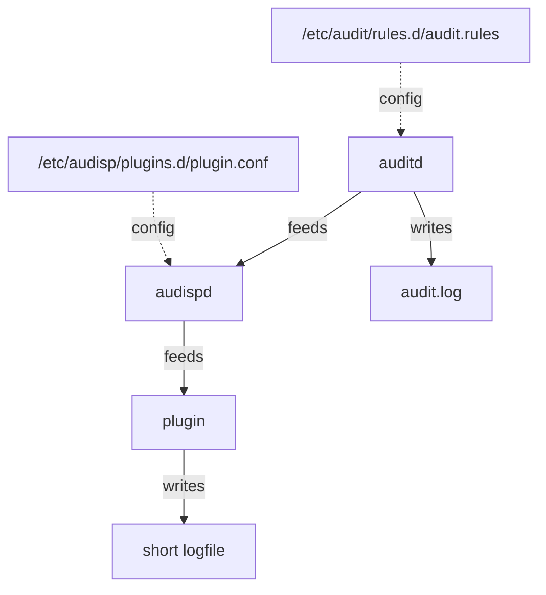

# Auditd Tools

*Python tools to handle auditd events*

Example:

```python
from auditd_tools.event_parser import AuditdEventParser
import sys

p = AuditdEventParser()
for line in sys.stdin:
    for event in p.parseline(line):
        print(event['action'])  # -> opened-file
        print(event['filepath'])  # -> /home/joerg/tmp/hallo
        print(event['datetime'])  # -> 2022-05-30 13:55:17.020000
```

This collection of tools provides:

- An [event_parser](#using-the-parser) (see above), which handles events emitted by `auparse`, and
  returns python dicts representing these events.
- An [example plugin](#using-the-plugin) for `audispd`, which writes out filesystem changes in a
  directory of choice to a logfile.
- [Command line tools](#command-line-tools) to transform auditd events into more structured
  formats (and display them)

If you want you can read some lines about the [background](#background) first.

It all relies heavily on the work of Steve Grubb, e.g.

- https://security-plus-data-science.blogspot.com/2017/06/using-auparse-in-python.html

Also, a friend of mine was heavily involved.

## Status

This is pretty much alpha, but it seems to work. Don't rely on it, better pick it apart and please
give
me feedback about my errors.

## Requirements

You need to install some packages for your distro:

    sudo apt install auditd ausispd-plugins python3-audit 

## Using the parser

The parser lives in [event_parser.py](src/auditd_tools/event_parser.py)

The [command line tools](#command-line-tools) section give examples of how to use the parser.
Generally speaking, you will feed line by line of input to `AuditdEventParser.parse_line`, which
might return a list of events or `None`. The events have the following structure:

- event - the event dictionary
    - **action** - name of a filesystem action if suitable
    - **datetime** - datetime of the event, derived from the timestamp
    - **filepath** - the affected filepath (guessed)
    - **key** - the key that was configured in the `audit.rules`
    - **serial** - serial number of the event
    - **timestamp** - the actual timestamp of the event
    - **normalized** - there seems to be way to normalize the data for the event. That info is in
      here.
    - **records** - a list of record dictionaries for this event. Depends on the call what is in it
        - _**raw** - a dictionary of the raw values as delivered by audit.d
        - **_other keys_** - record specific data, encoded, interpreted and ints properly cast

## Using the plugin

Install the package:

    pip3 install auditd_tools

(You might want to do this using the system python, or use a virtualenv, and then adapt the plugin
file to show to that virtualenv python)

You also need the script files:

    git clone https://github.com/jhb/auditd_tools.git

Copy and adapt the `audit.rules` (this might override existing rules, watch out):

    cd auditd_tools
    sudo cp examples/audit.rules /etc/audit/rules.d

(you could also write the rules to a separate file in that directory, see
the [auditd documentation](https://access.redhat.com/documentation/en-us/red_hat_enterprise_linux/7/html/security_guide/sec-defining_audit_rules_and_controls#sec-Defining_Audit_Rules_and_Controls_in_the_audit.rules_file)
for that)

Make sure that the right directory is watched (e.g. replacing `/home/joerg/tmp`), and set the
(event-)key to whatever you like. For more information on the exclusion of entries, read:

- https://access.redhat.com/solutions/35978
- https://access.redhat.com/documentation/en-us/red_hat_enterprise_linux/6/html/security_guide/sec-audit_record_types

Next, configure the plugin for `audispd`:

    sudo cp audisp_fsaction_plugin.conf /etc/audisp/plugins.d

And adapt the file, especially the paths to the plugin and the logfile.

Make sure the actual plugin is owned by root:

    sudo chown root auditd_tools/examples/audisp_fs_action_plugin.py

Restart the server:

     sudo service auditd restart

If everything worked out,

    sudo service auditd status

should give you something like this:

```
# service auditd status
auditd.service - Security Auditing Service
     Loaded: loaded (/lib/systemd/system/auditd.service; enabled; vendor preset: enabled)
     Active: active (running) since Mon 2022-05-30 12:52:11 CEST; 1s ago
       Docs: man:auditd(8)
             https://github.com/linux-audit/audit-documentation
    Process: 367278 ExecStart=/sbin/auditd (code=exited, status=0/SUCCESS)
    Process: 367285 ExecStartPost=/sbin/augenrules --load (code=exited, status=0/SUCCESS)
   Main PID: 367279 (auditd)
      Tasks: 5 (limit: 37508)
     Memory: 4.8M
     CGroup: /system.slice/auditd.service
             ├─367279 /sbin/auditd
             ├─367281 /sbin/audispd
             └─367283 python3 /home/joerg/projects/audit/auditd_tools/examples/audisp_fsaction_plugin.py fsaction /home/joerg/projects/audit/fsaction_plugin.log

```

If you don't see the `audispd` line or the plugin line, check syslog for messages that will help you
debug:

    sudo cat /var/log/syslog | grep audit

Now, if you e.g. `echo 'foo' > bar` in your directory, it should show up in the logfile.

## Command line tools

Use

    sudo ausearch --start today --raw | ./examples/pprint_events.py -

to translate the events to python and have them pretty printed

Use

    sudo ausearch --start today --raw | ./examples/jsonify_events.py -

to translate the events to json, and have them printed line by
line ([jsonl](https://jsonlines.org/))

Use

    sudo ausearch --start today --raw --key fsaction | ./examples/audisp_fsaction_plugin.py -

to print events as a list of file changes. You can provide an optional key as the second argument to
if you haven't filtered for it already in the input. (yes, this is the plugin)

## Background

My use case is to have a full-text search like spotlight in macOS. What is nice there is that
changes in the filesystem are reflected in the search after a very short time. For this to happen
on my linux machine or a linux server, I would first need to be notified of the changes in the
filesystem, e.g. when a file was written.

I could use `inotify` for the notification, but the directory is very large, and that means that
inotify will take rather long to set up all watches, and will miss on writes during that period.

The solution at hand builds on `auditd`, which is a service that can monitor all kind of events.
It's standard logfile in `/var/log/audit/audit.log` is rather cryptic. In short, it contains one
record per line, and records with the same event serial are parts of the same event.
The records don't come in order, [see below](#order-of-records).

The idea is to instead use python to parse the events, and write a much smaller "sane" logfile
somewhere. For this, we use `audispd`, which is an event multiplexer that gets events from auditd,
and passed them one to multiple plugins (which read from stdin, and do whatever they want).



For this to work, we need to set up `audit.rules` to watch our desired directory, and assign a
specific key to mark those events. A suitable `plugin.conf` will then tell `audispd` to feed events
to the configured plugin.

See:

- https://access.redhat.com/documentation/en-us/red_hat_enterprise_linux/8/html/security_hardening/auditing-the-system_security-hardening
- https://documentation.suse.com/sles/12-SP4/html/SLES-all/cha-audit-comp.html

## Order of records

https://manpages.debian.org/testing/auditd/auditd.conf.5.en.html tells us:

> Auditd events are made up of one or more records. The auditd system cannot guarantee that the set
> of records that make up an event will occur atomically, that is the stream will have interleaved
> records of different events, IE
>
>
> event0_record0  
> event1_record0  
> event2_record0  
> event1_record3  
> event2_record1  
> event1_record4  
> event3_record0
>
> The auditd system does not guarantee that the records that make up an event will appear in order.
> Thus, when processing event streams, we need to maintain a list of events with their own list of
> records hence List of List (LOL) event processing.
>
> When processing an event stream we define the end of an event via
>
> record type = AUDIT_EOE (audit end of event type record), or  
> record type = AUDIT_PROCTITLE (we note the AUDIT_PROCTITLE is always the last record), or  
> record type = AUDIT_KERNEL (kernel events are one record events), or  
> record type < AUDIT_FIRST_EVENT (only single record events appear before this type), or  
> record type >= AUDIT_FIRST_ANOM_MSG (only single record events appear after this type), or  
> record type >= AUDIT_MAC_UNLBL_ALLOW && record type <= AUDIT_MAC_CALIPSO_DEL (these are also one
> record events), or for the stream being processed, the time of the event is over
> end_of_event_timeout seconds old.
